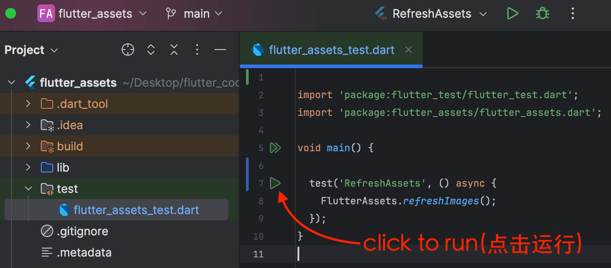
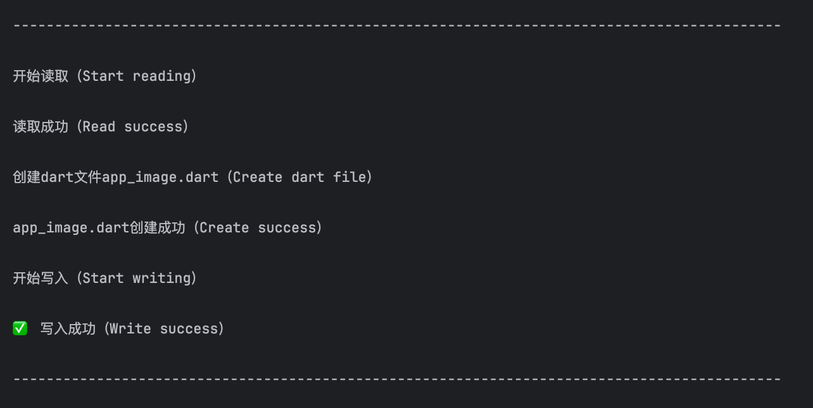
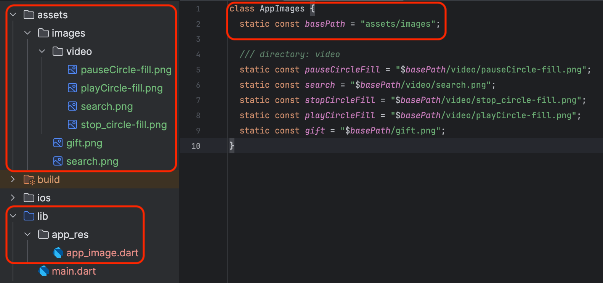

## Features

帮助你在flutter开发中快速生成图片资源相关代码    
Help you quickly generate code related to image resources in Flutter development

## Getting started

#### 在pubspec.yaml文件中添加如下依赖（Add this to your package's pubspec.yaml file:）   

```yaml
dev_dependencies:
  flutter_assets: ^0.0.1
```

#### 设置图片路径 (Set image path)   
   


## Usage

### 步骤1：在test目录下创建一个test.dart文件，输入如下代码：
Step1：in the test directory, create a test.dart file, and enter the following code:

```dart
void main() {
  test('RefreshAssets', () {
    /// projectPath: 项目路径，自动读取项目根目录
    /// imagePath: 图片资源存放路径, 默认 assets/images
    /// codePath: 代码生成路径, 默认使用 lib/app_res
    /// codeName: 代码生成文件名称，默认使用 app_image
    /// className: 生成的类名，默认使用 AppImages
    /// maxLineLength: 代码单行最大长度
    FlutterAssets.refreshImages(
      projectPath: "",
      imagePath: "assets/images",
      codePath: "lib/app_res",
      codeName: "app_image",
      className: "AppImages",
      maxLineLength: 80,
    );
  });
}
```

### 步骤2：点击test.dart文件中的运行按钮，生成图片资源代码
Step2：Click the run button in the test.dart file to generate the image resource code


### 运行成功（Run Successfully）


### 自动生成文件（Automatically generate files）



### 第一次运行成功后，在AndroidStudio顶部工具栏中可以看到RefreshAssets，以后可以直接选择该选项，一键运行
After the first successful run, you can see RefreshAssets in the top toolbar of AndroidStudio, and you can directly select this option for one-click operation in the future


### 运行成功（Run Successfully）


